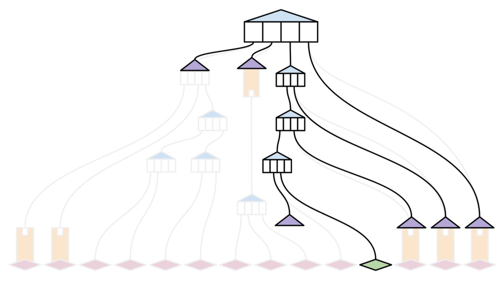
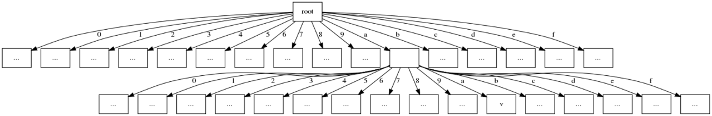
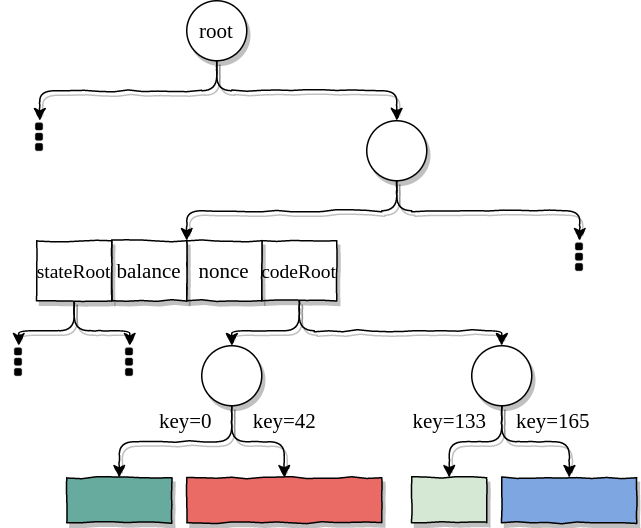
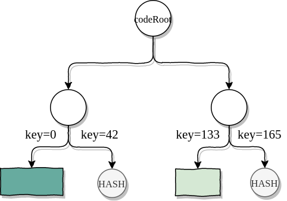
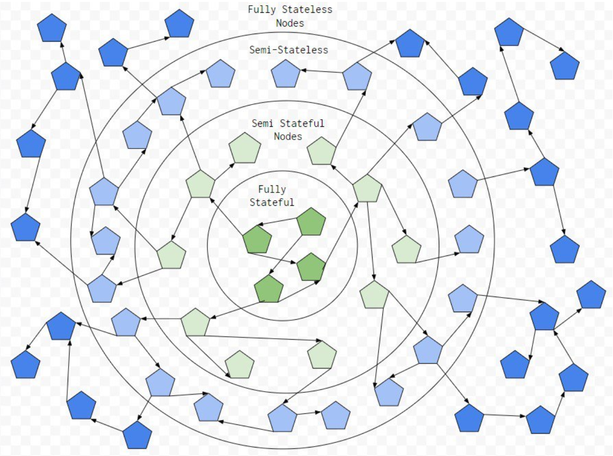

## 要解决的问题

- 状态爆炸，全节点硬件要求越来越高
- 新节点加入网络需要很长时间同步，怎么能快速加入

## 方案

无状态客户端的核心思想是：在区块中执行交易过程时，不访问整个状态(不使用硬盘 DB 来执行区块)。区块创建者以分离的数据结构作为区块补充，里面提取了执行交易所需的所有内容 —— “区块见证数据（block witness）”，它会跟相应的区块一起传播；拥有了这段数据，客户端就可以重建出一个（代表部分状态的）默克尔子树，该分支足可用于执行该区块中的所有交易。

一个区块验证（witness）证明提供了状态trie中验证该区块交易所需要的哈希，如下图，图中绿色部分为某笔交易所更改的状态，紫色为witness所提供的哈希。并结合了关于这些哈希在trie中属于何处的一些“结构”信息， 以及被交易访问的智能合约字节码。这允许新节点将新交易包含在其状态中，并在本地计算新的根哈希，而不需要它们下载状态trie的整个副本。

### 见证数据

#### 规范

witness规范草案
https://github.com/ethereum/stateless-ethereum-specs/blob/master/witness.md

区块见证数据的大小，无优化方案情况下，平均每区块在1MB上下，区块大小0.02MB上下。导致需要传播区块见证数据就意味着无状态客户端的网络要求要比普通节点更高。

降低见证数据规模的思路： https://ethresear.ch/t/survey-of-proposals-to-reduce-block-witness-size/7173 其中比较流行/有用的方案如下。

#### 二叉树

将以太坊的默克尔树（即用来表示以太坊的默克尔树）从十六进制转为二进制，理论上可以三倍+减小哈希的数量。

目前，以太坊的状态树是十六叉制的。十六叉制表示每个节点有 16 个孩子节点。如下图。

如果切换到二叉树，理论上可以缓解此问题，因为每个节点只有2个子节点，因此最多只能将其中一个替换为哈希。这样会使得witness中哈希的数量大大减少。对500-650万区块的实验结果表明，使用二叉树的方案大概能将witness的大小减少一半。实际情况还要看交易的具体情况。

#### 代码分块 

见证的一个主要组成部分就是合约代码。如果不进行代码分块，包含合约调用的事务将需要该合约的完整字节码，以验证其codeHash。代码大小取决于合约，可能会是非常庞大的。代码分块用来拆分合约字节码，只需要生成代码的一部分即可生成并验证交易的见证，这是一种大大减小见证平均大小的技术。

在以太坊中，一个基本块（basic block）由一系列的指令构成，有一个入口和一个出口，入口就是第一个指令，出口就是最后一个指令。出口的类型有: 
1. 条件跳转
2. 非条件跳转
3. 结束指令
4. 什么都没有，直接fall to下一个block

首先将合约代码分为若干basic block。Basic block 要么从索引 0 开始，要么从 JUMPDEST 开始（JUMPDEST表明这个Block是一个跳转的起始位置）。每个 basic block 都无法更改控制流，因此，我们可以确定一旦开始执行代码，只会存在两种情况：正确执行结束，或是 gas 耗尽。

出于效率考量，我们合并相邻块，直到每个代码块都至少有 128 字节（可自行设置）为止。接着以第一个字节作为 key，将这些合并后的代码块插进 Trie。最后，客户端将此 Trie 的根作为该合约账户的新记录存储下来。如下图所示，记录代码的 Trie 会成为状态树的子树。

矿工会执行这笔交易，并标记执行过程中触及的每个 chunk（例子里假设触及 chunk#1 和 chunk#3 ）。当要发布区块的时候，矿工会将合约状态的证明，以及触及哪些代码 chunk 的 turboproof 证明，一起打包在区块内。

实验结果表明，该方案平均能将代码的大小减少一半左右。实际情况还要看交易的具体情况。

#### 多项式承诺

可以将witness大小减少到几十KB。

多项式承诺大致流程：

- 问题转化为电路
- 将所有门表达为式子，并转化为统一的多项式---->门约束
- 通过构造坐标对累加器保证线的约束成立------>复制约束
- 取一个点值带入简化多项式
- 将上述多项式组合起来构建承诺

验证时，通过在某些随机值z处打开承诺进行验证。

多项式承诺需要trusted setup，可信设置过程生成一组椭圆曲线点G, G * s, G * s^2 …. G * s^n，以及G2 * s，其中G 和G2是两个椭圆曲线组的生成器，而s则是一个一旦程序完成就会被遗忘的秘密。这些点会被公布，并被认为是方案的“证明关键”，任何需要作出多项式承诺的人都需要使用这些点。通过将证明密钥中的前d+1个点中的每一点乘以多项式中的相应系数，并将结果相加，对d次多项式作出承诺。

相比将状态存储为默克尔树（Merkle tree），我们选择将状态存储为两个多项式S_k(x) 和S_v(x) ，其中S_k（1），...，S_k（N）表示键（key），而S_v（1），.. 。，S_v（N）表示这些键（key）上的值（如果值大于字段大小，则至少表示这些值的哈希值）。用“多项式承诺”（polynomial commitments）的来替代默克尔树（Merkle tree）来累积区块链状态。并用开放证明替换默克尔分支（Merkle branches）。

~~~
如果P(z) = a ，可以针对多项式P(x)的承诺h_P生产一个证明，称为开放证明opening proof。
~~~

为了证明键值对（k_1，v_1），...，（k_k，v_k）是状态的一部分，我们将提供索引 i_1, ..., i_k 并显示与索引匹配的键和值，即k_1 = S_k(i_1), ..., k_k = S_k(i_k) 和 v_1 = S_v(i_1), ..., v_k = S_v(i_k)。

为了证明某些键（key）的非成员性，可以尝试构造一个奇特的证明，证明键（key）不在S_k（1），…，S_k（N）中。相反，我们只需对键（key）进行排序，以便证明非成员身份就足以证明两个相邻key的成员身份，一个小于目标key，一个则大于目标key。

## 涉及到的一些问题点

无状态客户端并不是一个简单的功能点，其采用需要系统其它部分做一些修改或者新增。

### 网络节点分布和数据传播

如果整个网络里面所有节点都无状态的话，那么，交易发起方是无法构建交易proof的，且区块生产者也无法构建witness。所以理想情况会是一部分无状态，一部分全状态，一部分临时状态状态或者半状态，或者有专门的状态提供者。 无状态的以太坊不会完全消除状态。相反，它将使状态成为可选的事情，从而允许客户端在跟踪和计算自己的状态数量方面具有一定程度的自由度，可以只保留我感兴趣的那一部分状态数据，也可以都不保留0状态，也可以从某一区块起全部保留。

显然，成为无状态客户端是最省力的做法。那么，怎么才能保证始终能从网络中获取状态？网络中始终有能够提供状态的节点？可能需要一些激励措施。

一个无状态的节点怎么判断连接的对等方保留了哪些状态部分？如果所有连接的对等方都不具有所需的状态怎么办？

或许需要一种确定性机制，通过该机制，节点可以确定可以在网络中找到数据的“位置”。一个可能的方案是：允许通过连接的对等节点代理对状态的请求，并通过分布式哈希表查找其正确的目的地。

### Beam同步

区块见证给用户提供了一种新的同步方案。Beam同步方案不再等待收集检查点trie中的每个节点，而是开始监视并尝试在交易发生时执行交易，从全节点请求每个区块的witness内容，以获取它没有的信息。随着越来越多的状态被新交易“触及”，客户端可渐渐更多地依赖自己的状态副本，这通过beam同步逐渐填充，直到最终切换到完全同步。

与beam同步方案相比，真正的无状态客户端永远不会保留状态副本，它只会与验证（witness）内容一起获取最新的交易，并拥有执行下一个区块所需的一切。 零状态节点希望使其客户端尽可能轻地运行，它们可以完全依赖验证（witness）内容来验证新的区块。

### 收费与激励问题

生成区块的见证需要进行一些计算，该计算将由区块的矿工执行，因此需要有相关的GAS成本，由交易的发送方支付。

### 交易验证

交易在传播过程中需要进行验证，以避免一些无效的垃圾交易占用网络资源。但是，验证交易是否有效是需要检查状态树的，无状态客户端并没有最新的状态树。此时，可能就需要交易发起者构建交易有效的proof，连带交易一起传播。

多项式承诺相关资料：

https://vitalik.ca/general/2019/09/22/plonk.html

https://ethresear.ch/t/using-polynomial-commitments-to-replace-state-roots/7095

https://eprint.iacr.org/2019/953.pdf

https://www.unitimes.pro/en/p/ba794b9690874386b82491def6a08800

https://blog.csdn.net/guoyihaoguoyihao/article/details/103860357

https://blog.csdn.net/guoyihaoguoyihao/article/details/104715756

https://blog.csdn.net/guoyihaoguoyihao/article/details/104719738

https://blog.csdn.net/guoyihaoguoyihao/article/details/104732802

https://blog.csdn.net/guoyihaoguoyihao/article/details/104734609

https://blog.csdn.net/guoyihaoguoyihao/article/details/104735082

https://www.chainnode.com/post/414475

总结：

无状态客户端要达到实施状态，考虑到网络传输限制，亟待解决的问题是缩小witness的大小。二进制树的目的是减少witness中的哈希数量，代码分块目的是减少代码量，两者都可以做到成倍的减小witness。多项式承诺是最有效的方案，可以几十倍的缩小witness，且为常量大小。但是，目前暂无现成的代码库，自己写的话实现难度较大。
